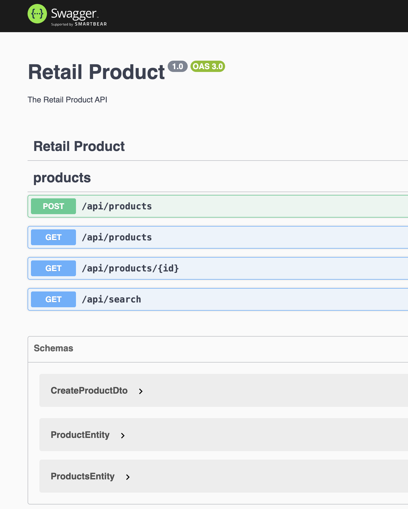

<h1>Retail Product Backend</h1>

Hi.

This is a sample code for implementing Rest APIs in NestJS.

It is a retail product catalog application with a backend that supports searching for
products to accommodate user input errors and approximations. The front end provides a
user-friendly interface to search and display products.

## Used Technologies and Patterns

- NestJS - The main structure of the application.
- cache-manager - in-memory data store
- Swagger - To generate open API document.

## Main Sections

- API endpoints

## API endpoints

- Products APIs for adding and fetching products.

## Database

- no database being used in this project. Just using cache-manager to keep data in memory

## cache-manager

Nest provides the cache-manager package which is an in-memory cache. Also, we can easily switch to another solution, like Redis. It is utilized for the counter steps in this application.

## Postman documents

Postman API endpoint documents and environment are available in the postman-docs folder.

## Installation

```bash
$ npm install
```

## Running the app

```bash
# development
$ npm start

# watch mode
$ npm run start:dev

# production mode
$ npm run start:prod
```

## Test

Separate DB is used for testing purposes and it is managed properly.

```bash
# Eslint
$ npm run lint

# unit tests
$ npm run test

# e2e tests
$ npm run test:e2e

# test coverage
$ npm run test:cov
```

## API Document

Swagger is used to generate API documents automatically. Follow below steps to see the document.

1. Run the application

```bash
$ npm run start
```

2. Open the following address `http://localhost:3000/api/` in browser



## App is running

```bash
$ http://localhost:3000
```
